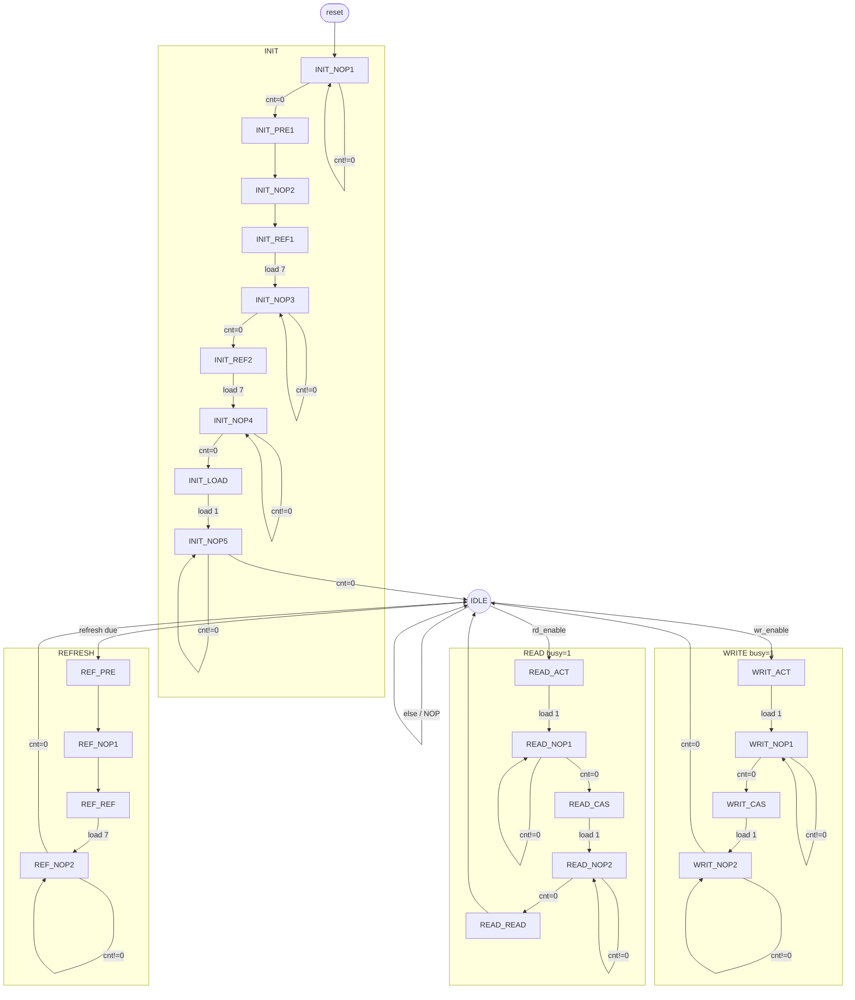

# _SDRAM Memory Controller_

`CURRENT STATUS : ported to DE0-CV`

This is a very simple sdram controller targeting the Terasic DE0-CV
(Cyclone V `5CEBA4F23C7`) SDRAM. This repository is a port of the original
[stffrdhrn/sdram-controller](https://github.com/stffrdhrn/sdram-controller)
DE0-Nano design.

Basic features
 - Operates at 100Mhz, CAS 3, 64MB, 16-bit data
 - Geometry: 4 banks x 8192 rows x 1024 columns (host address `{bank,row,col}` is 25 bits)
 - On reset will go into `INIT` sequnce
 - After `INIT` the controller sits in `IDLE` waiting for `REFRESH`, `READ` or `WRITE`
 - `REFRESH` operations are spaced evenly 8192 times every 64ms
 - `READ` is always single read with auto precharge
 - `WRITE` is always single write with auto precharge

Target hardware (from the DE0-CV User Manual)
 - FPGA: Cyclone V `5CEBA4F23C7N`
 - SDRAM: 64MB (32M x 16), ISSI IS42S16320F or equivalent, 3.3-V LVCMOS

## SystemVerilog

The controller is `rtl/sdram_controller.sv`. Dependencies are managed by [Bender](https://github.com/pulp-platform/bender):

```
bender update
```

This checks out `rtl_primitive` (`DFFR` / `DFFR_VAL` macros) into `deps/`. Combinational logic is `assign` only. Override `CLK_FREQUENCY` if the clock is not 100 MHz.

## Simulation

```
# requires Verilator (and a C++ compiler) plus bender checkout
make -C tb sim
```

```

 Host Interface          SDRAM Interface

   /-----------------------------\
   |      sdram_controller       |
==> wr_addr                  addr ==>
==> wr_data             bank_addr ==>
--> wr_enable                data <=>
   |                 clock_enable -->
==> rd_addr                  cs_n -->
--> rd_enable               ras_n -->
<== rd_data                 cas_n -->
<-- rd_ready                 we_n -->
<-- busy            data_mask_low -->
   |               data_mask_high -->
--> rst_n                        |
--> clk                          |
   \-----------------------------/

```

From the above diagram most signals should be pretty much self explainatory. Here are some important points for now.  It will be expanded on later.
 - `wr_addr` and `rd_addr` are equivelant to the concatenation of `{bank, row, column}`
 - `rd_enable` should be set to high once an address is presented on the `addr` bus and we wish to read data.
 - `wr_enable` should be set to high once `addr` and `data` is presented on the bus
 - `busy` will go high when the read or write command is acknowledged. `busy` will go low when the write or read operation is complete.
 - `rd_ready` will go high when data `rd_data` is available on the `data` bus.
 - **NOTE** For single reads and writes `wr_enable` and `rd_enable` should be set low once `busy` is observed.  This will protect from the controller thinking another request is needed if left higher any longer.

## State machine

`state_cnt != 0` holds the current state (and the current SDRAM command). Commands while each state is active are in the table below. `busy` is `state[STATE_WIDTH-1]` (high in READ_* and WRIT_* only).

IDLE priority: refresh, then `rd_enable`, then `wr_enable`.



| State | Command | Stay (clk) | Notes |
| --- | --- | ---: | --- |
| INIT_NOP1 | NOP | 16 | reset loads `cnt=15` |
| INIT_PRE1 | PALL | 1 | precharge all |
| INIT_NOP2 | NOP | 1 | |
| INIT_REF1 | REF | 1 | |
| INIT_NOP3 | NOP | 8 | tRFC (`cnt=7`) |
| INIT_REF2 | REF | 1 | |
| INIT_NOP4 | NOP | 8 | tRFC (`cnt=7`) |
| INIT_LOAD | MRS | 1 | CAS 3, BL 1 |
| INIT_NOP5 | NOP | 2 | tMRD (`cnt=1`) |
| IDLE | NOP | — | wait for refresh / read / write |
| REF_PRE | PALL | 1 | |
| REF_NOP1 | NOP | 1 | |
| REF_REF | REF | 1 | |
| REF_NOP2 | NOP | 8 | tRFC (`cnt=7`) |
| READ_ACT / WRIT_ACT | BACT | 1 | row address |
| READ_NOP1 / WRIT_NOP1 | NOP | 2 | tRCD (`cnt=1`) |
| READ_CAS | READ | 1 | col, A10 auto-precharge |
| WRIT_CAS | WRIT | 1 | col, A10 auto-precharge, DQ |
| READ_NOP2 | NOP | 2 | CAS latency (`cnt=1`) |
| READ_READ | NOP | 1 | `rd_ready`, capture DQ |
| WRIT_NOP2 | NOP | 2 | (`cnt=1`) then IDLE |

## Timings

Initialization:
 - Precharge all banks
 - 2 refresh cycles
 - Mode programming

Refresh:
 - Precharge all banks
 - Single Refresh

Write:
 - Bank Activation & Row Address Strobe
 - Column Address Strobe with Auto Precharge set and Data on bus

Read:
 - Bank Activation & Row Address Strobe
 - Column Address Strobe with Auto Precharge set
 - Data on bus


## Project Status/TODO
 - [x] Simulated `Init`
 - [x] Simulated `Refresh`
 - [x] Simulated `Read`
 - [x] Simulated `Write`
 - [x] Ported SDRAM geometry to DE0-CV

## License
BSD

## Further Reading
I didn't look at these when designing my controller.  But it might be good to take a look at for ideas.
 - http://hamsterworks.co.nz/mediawiki/index.php/Simple_SDRAM_Controller - featured on hackaday
 - http://ladybug.xs4all.nl/arlet/fpga/source/sdram.v - Arlet's implementation from a comment on the hackaday article
